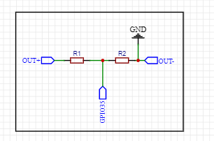

# Nyuki-Tech

NB - Utilities.h and The Ino file need to be in the same folder.

### DHT Sensor Pinout

| DHT Pin | ESP32 Pin | Function |
| ------- | --------- | -------- |
| VCC     | 3V3       | Power    |
| GND     | GND       | Ground   |
| DATA    | GPIO15    | Data     |

## Power Management

This project uses a **TP4056 Charge Module** for battery charging and power management. The TP4056 module connects as follows:

| TP4056 Pin | Connected To        | Description                            |
| ---------- | ------------------- | -------------------------------------- |
| IN+        | Solar +             | Solar panel positive input             |
| IN-        | Solar -             | Solar panel negative input             |
| BAT+       | Battery +           | Battery positive terminal              |
| BAT-       | Battery -           | Battery negative terminal              |
| OUT+       | Battery Connector + | Power output positive (to ESP32, etc.) |
| OUT-       | Battery Connector - | Power output ground                    |

This setup allows the solar panel to charge the battery, while the system draws power from the battery via the TP4056 output.

### Voltage Divider Wiring for Battery Sensing

```
TP4056 OUT+ (4.2V max) ──┬── To TTGO Battery Connector (+)
						 │
						 ├── 10kΩ Resistor #1
						 │
						 ├── GPIO 35 (ADC Pin)
						 │
						 ├── 10kΩ Resistor #2
						 │
TP4056 OUT- (GND) ───────┴── To TTGO Battery Connector (-)

NB - ESP32 Ground must also be connected to the TP4056 OUT -
```



This voltage divider allows safe battery voltage monitoring using the ESP32's ADC pin (GPIO 35).

Top side


bottom side


PCB_UP


Schematic


NB: From the power supply to the MCU board, we will loop a wire.
